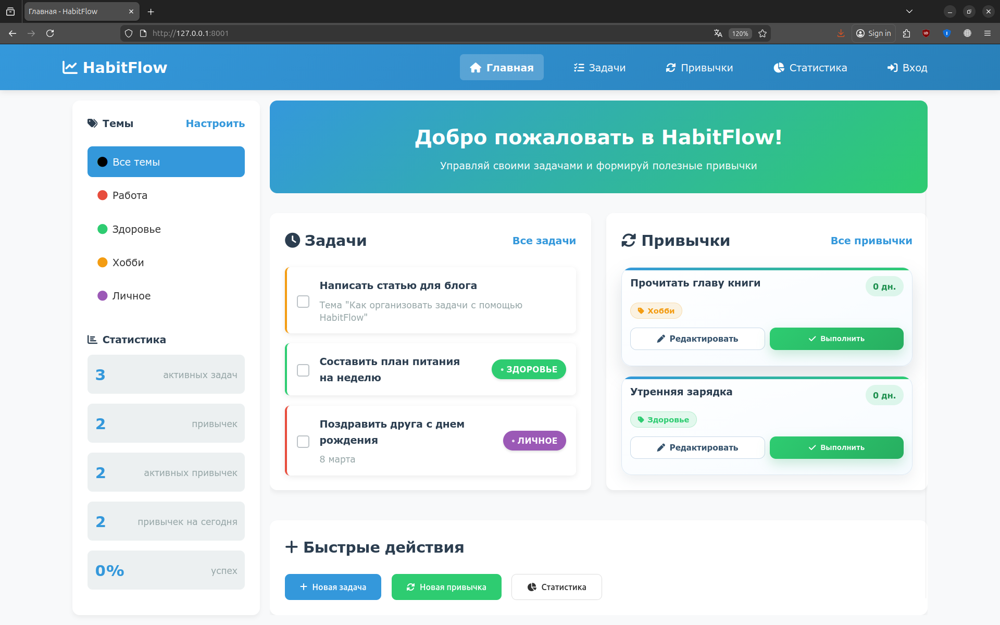
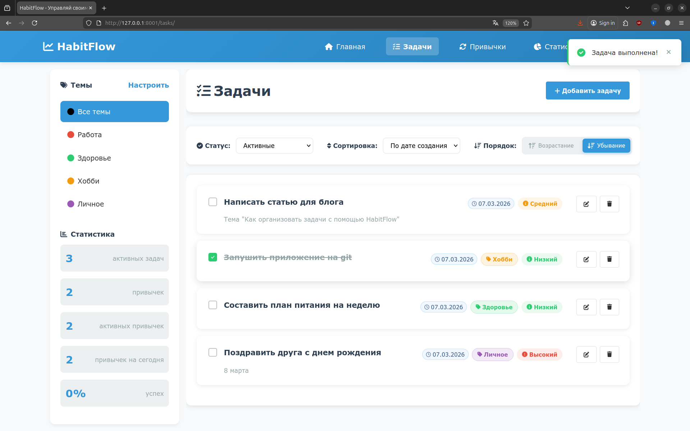
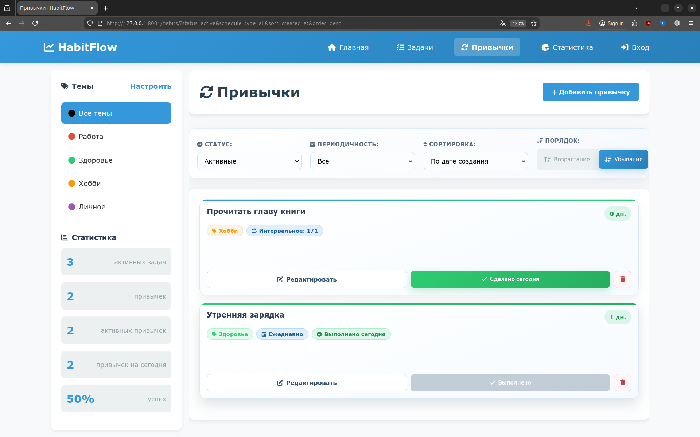
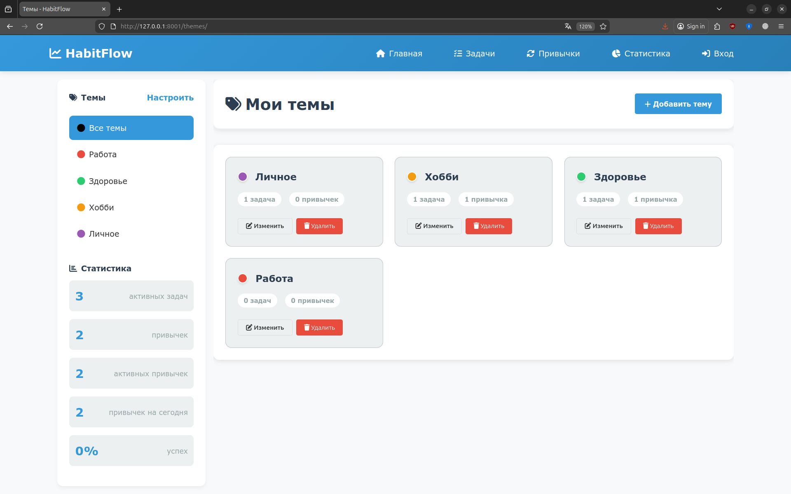

# HabitFlow

HabitFlow — веб-приложение для управления задачами и привычками.

Проект развивается в режиме **web-first**:
- основной интерфейс: серверные веб-роуты (`HTML + Redirect + AJAX JSON`);
- отдельный JSON API под `/api/*` — дополнительный (опциональный) трек.

<div align="center">
  
  <p><em>Главная страница</em></p>
</div>
<div align="center">
  
  <p><em>Страница со списком задач</em></p>
</div>
<div align="center">
  
  <p><em>Страница со списком привычек</em></p>
</div>
<div align="center">
  
  <p><em>Страница с темами</em></p>
</div>

## Стек технологий

- **Backend**: Python 3.12, FastAPI, SQLAlchemy 2.0, Alembic
- **База данных**: PostgreSQL (asyncpg), Redis (опционально; адаптер есть, но по умолчанию не используется)
- **Фронтенд**: Jinja2, HTML, CSS, JavaScript (минимальный)
- **Инфраструктура**: Docker, Docker Compose
- **Инструменты**: Poetry, pre-commit, Ruff, mypy, pytest

## Структура проекта

```
.
├── alembic.ini                # Конфигурация Alembic
├── docker-compose.yml         # Запуск сервисов app + postgres
├── Dockerfile                 # Сборка образа приложения
├── Makefile                   # Удобные команды для разработки
├── pyproject.toml             # Зависимости и настройки инструментов
├── poetry.lock                # Фиксация версий зависимостей
├── .env.example               # Пример переменных окружения
├── .pre-commit-config.yaml    # Настройки pre-commit хуков
├── .gitignore                 # Игнорируемые файлы
├── docs/                      # Проектная документация
│   ├── overview.md            # Цели, границы, правила работы
│   ├── backend_roadmap.md     # План реализации по итерациям
│   ├── api_contract.md        # Web-first HTTP-контракт текущих роутов
│   └── testing_strategy.md    # Тестовая матрица и quality gates
├── src/                       # Исходный код приложения
│   ├── main.py                # Точка входа FastAPI
│   ├── config.py              # Настройки через Pydantic Settings
│   ├── database/              # Работа с БД
│   │   ├── connection.py      # Подключение и сессии
│   │   ├── models/            # SQLAlchemy модели
│   │   └── migrations/        # Миграции Alembic
│   ├── repositories/          # Репозитории (паттерн Repository)
│   ├── services/              # Бизнес-логика
│   ├── routers/               # Эндпоинты (роутеры FastAPI)
│   ├── schemas/               # Pydantic модели (схемы)
│   ├── templates/             # HTML шаблоны Jinja2
│   ├── static/                # Статические файлы (CSS, JS)
│   ├── redis.py               # Адаптер для работы с Redis
│   ├── dependencies.py        # Зависимости FastAPI
│   ├── exceptions.py          # Кастомные исключения
│   └── utils.py               # Вспомогательные функции
├── tests/                     # Тесты
│   ├── conftest.py            # Фикстуры pytest
│   ├── unit/                  # Unit-тесты сервисов
│   ├── api_unit/              # Контрактные тесты роутеров
│   └── integration/           # Интеграционные тесты с БД
├── conftest.py                # Bootstrap PYTHONPATH для pytest
└── README.md                  # Этот файл
```

## Документация проекта

- `docs/overview.md` — главный документ (цели, границы, инженерные принципы).
- `docs/backend_roadmap.md` — план работ и итерации.
- `docs/api_contract.md` — web-first контракт текущих роутов.
- `docs/testing_strategy.md` — стратегия тестирования и матрица покрытия.

## Требования

- **Python** 3.12+
- **Poetry** (для управления зависимостями)
- **Docker** и **Docker Compose** (для запуска через контейнеры)
- **Make** (опционально, для удобных команд)

## Быстрый старт

### 1. Клонирование репозитория

```bash
git clone https://github.com/Qwertyil/HabitFlow.git
cd HabitFlow
```

### 2. Настройка переменных окружения

Скопируйте `.env.example` в `.env` и отредактируйте при необходимости:

```bash
cp .env.example .env
cp .env.example .env.docker
```

Основные переменные:
- `POSTGRES_DB`, `POSTGRES_USER`, `POSTGRES_PASSWORD` — данные для PostgreSQL.
- `SECRET_KEY` — секрет для подписи сессий (обязателен для стабильных сессий).
- `REDIS_HOST`, `REDIS_PORT`, `REDIS_PASSWORD` — для Redis (опционально; не запускается в compose по умолчанию).
- `APP_PORT` — порт приложения внутри контейнера.

### 3. Запуск через Docker (рекомендуется)

Соберите и запустите контейнеры (по умолчанию `app` + `postgres`):

```bash
make restart
# или вручную:
docker compose up -d --build
```

Примените миграции:

```bash
make migration
# или вручную:
docker compose exec app alembic upgrade head
```

Приложение будет доступно по адресу `http://localhost:8000` (порт из переменной `APP_PORT`).

### 4. Локальный запуск приложения

Установите зависимости:

```bash
poetry install
```


Запустите сервер:

```bash
make run
# или вручную:
poetry run uvicorn src.main:app --reload --port 8001
```

Приложение будет доступно по адресу `http://localhost:8001`.

В данном случае предполагается что контейнер с БД уже запущен, а миграции применены (например, после выполнения п.3.)

## Команды Makefile

- `make run` — запустить локальный сервер разработки (uvicorn с перезагрузкой).
- `make test` — запустить тесты (с выводом подробностей).
- `make lint` — проверить код линтером Ruff.
- `make format` — отформатировать код (Ruff format + fix).
- `make typecheck` — проверить типы mypy.
- `make pre-commit` — запустить все хуки pre-commit вручную.
- `make check` — выполнить форматирование, линтинг, проверку типов и тесты (последовательно).
- `make restart` —запустить Docker-контейнеры.
- `make migration` — применить миграции внутри контейнера.
- `make psql` — подключиться к PostgreSQL внутри контейнера. при изменении данных для входа в `.env` отредактируйте данную команду.

## Тестирование

Проект использует **pytest**. Тесты находятся в `tests/`. Для запуска:

```bash
make test
```

или с детализацией:

```bash
poetry run pytest -v
```

Основные уровни тестов:
- `tests/unit` — unit-тесты бизнес-логики;
- `tests/api_unit` — контрактные тесты роутеров;
- `tests/integration` — интеграционные тесты с БД.

Подробные правила покрытия и критерии завершения задач: `docs/testing_strategy.md`.

## Pre-commit хуки

Pre-commit автоматически запускает проверки перед каждым коммитом. Чтобы установить хуки локально:

```bash
poetry run pre-commit install
```

При коммите будут выполняться:
- удаление лишних пробелов,
- проверка YAML/TOML,
- форматирование Ruff,
- проверка типов mypy.

## Миграции базы данных

Создание новой миграции (после изменения моделей):

```bash
alembic revision --autogenerate -m "description"
```

Применение миграций:

```bash
alembic upgrade head
```

В Docker используйте `make migration`.

## Переменные окружения

| Переменная           | Описание                          | Значение по умолчанию |
|----------------------|-----------------------------------|-----------------------|
| POSTGRES_DB          | Имя базы данных PostgreSQL        | mydatabase            |
| POSTGRES_USER        | Пользователь PostgreSQL           | myuser                |
| POSTGRES_PASSWORD    | Пароль PostgreSQL                 | mypassword            |
| POSTGRES_HOST        | Хост PostgreSQL (локально)        | localhost             |
| POSTGRES_PORT        | Порт PostgreSQL                   | 5432                  |
| REDIS_HOST           | Хост Redis                        | localhost             |
| REDIS_PORT           | Порт Redis                        | 6379                  |
| REDIS_PASSWORD       | Пароль Redis                      | (пусто)               |
| REDIS_DB             | Номер базы Redis                  | 0                     |
| APP_PORT             | Порт приложения в контейнере      | 8000                  |
| SECRET_KEY           | Секрет подписи cookie-сессий      | (сгенерируйте сами)   |
| SESSION_COOKIE_NAME  | Имя cookie сессии                 | habitflow_session     |
| SESSION_MAX_AGE      | Время жизни сессии (сек.)         | 1209600               |
| SESSION_SAME_SITE    | SameSite для cookie               | lax                   |
| SESSION_HTTPS_ONLY   | Secure-флаг cookie (HTTPS only)   | False                 |
| API_KEY              | Технический ключ приложения (в текущем `Settings` обязателен) | your_api_key_here     |
| DEBUG                | Режим отладки (True/False)        | True                  |
