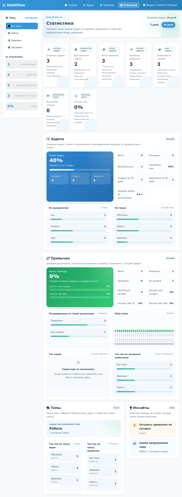

# HabitFlow

[](https://github.com/Qwertyil/HabitFlow/actions/workflows/ci.yml)
[](https://github.com/Qwertyil/HabitFlow/actions/workflows/codeql.yml)
[](https://codecov.io/gh/Qwertyil/HabitFlow)
[](https://www.python.org/)
[](https://fastapi.tiangolo.com/)
[](https://www.postgresql.org/)
[](https://redis.io/)
[](https://www.sqlalchemy.org/)
[](https://python-poetry.org/)
[](https://www.docker.com/)
[](https://pytest.org/)

HabitFlow is a web-first habit and task tracker that explores backend concerns beyond basic CRUD: recurring schedule logic, auth/session boundaries, owner-scoped data access, and reporting shaped by real product constraints.

## Live Demo

- https://www.amir-vps.ru

The goal of this repository is to show how a small productivity app quickly becomes an engineering problem:

- recurring habits are not just `daily yes/no`, but support daily, weekly, monthly, yearly, and interval-based schedules with streaks, due-today logic, and auto-archiving;
- browser UX and backend concerns meet in the same app: server-rendered pages, JSON-friendly endpoints, cookie auth, CSRF protection, safe redirects, OAuth, and rate-limited auth flows;
- the code reflects trade-offs that usually appear in production-style apps, not only in demos.

## Why This Repo Is Non-Trivial

- **Product logic is stateful and date-sensitive.**
  Habits have schedule rules, start/end windows, completion history, streaks, and "due today" behavior. That creates real edge cases around interval cycles, expired habits, and period-based statistics.
- **Security is treated like part of the product, not an afterthought.**
  The app separates UI session state from auth session state, stores auth sessions in Redis as opaque identifiers, enforces CSRF on state-changing requests, normalizes redirect targets, and rate-limits auth endpoints.
- **The transport layer handles real browser behavior.**
  The same backend supports HTML pages, redirects, and JSON responses, with centralized error handling and different unauthorized behavior for browser and API-like requests.
- **The project keeps a production-like shape without becoming overcomplicated.**
  PostgreSQL handles relational data and reporting queries, Redis handles sessions, Alembic manages schema evolution, and automated tests cover business logic, router behavior, and integration boundaries.

## Product Value

The value of HabitFlow is less in the feature list and more in the parts that are easy to get wrong in productivity products: deciding what is due, what counts as completed, how recurring routines behave over time, and how to keep personal data isolated and secure while still giving the user a simple browser experience.

For a hiring manager, the useful signal is less "there is a FastAPI app here" and more:

- ambiguous product behavior translated into explicit backend rules;
- pragmatic infrastructure choices instead of unnecessary complexity;
- attention to auth, ownership, and browser security details that often break late;
- tests used to verify those decisions instead of leaving them at the level of intent.

## Engineering Trade-Offs

- **Redis-backed opaque sessions instead of JWTs.**
  Simpler logout and session invalidation, better control over server-side auth state, at the cost of Redis as an operational dependency.
- **Separate UI session and auth session.**
  Keeps CSRF tokens and temporary browser state away from authentication state, which makes the security model clearer and easier to evolve.
- **APScheduler instead of a queue stack.**
  Good enough for lightweight recurring quote refresh jobs without introducing Celery, workers, or a broker for a single-service portfolio app.
- **Server-rendered web UI with backend-owned flows.**
  Less frontend complexity, faster iteration on auth and CRUD behavior, and more room to focus the project on backend decisions than a frontend-heavy architecture would provide here.
- **Layered architecture over "FastAPI everything in routers".**
  Slightly more boilerplate, but clearer boundaries for testing, refactoring, and explaining where business rules live.

## Backend Highlights

- Layered architecture: `routers -> services -> repositories -> models/schemas`
- Async FastAPI + SQLAlchemy 2.x + PostgreSQL
- Cookie-based auth with Redis-backed session storage
- Separate UI session middleware and auth session cookie handling
- CSRF protection for state-changing requests
- Owner-scoped access to user data across themes, tasks, habits, and stats
- Habit scheduling engine with multiple recurrence types
- Aggregated statistics page with period-based calculations
- Google OAuth login flow
- Background quote refresh job on application startup and scheduled intervals
- Unit, API-unit, and integration tests
- Strict static checks with Ruff and mypy

## Engineering Problems Solved

### Authentication and Sessions

- Implemented registration, login, logout, and session resolution.
- Stored auth sessions in Redis instead of in-memory state or self-contained cookies.
- Added optional Google OAuth flow with temporary state stored in UI session.
- Separated UI session middleware from auth session cookie handling.

### Data Ownership and Security

- Applied owner-scoped data access so users only work with their own records.
- Added CSRF protection for state-changing operations.
- Added safe redirect normalization for browser auth flows.
- Added rate limiting for auth-related routes.
- Centralized error handling for HTML and JSON responses.

### Domain Logic

- Implemented task priorities and status transitions.
- Built habit scheduling for daily, weekly, monthly, yearly, and interval-based routines.
- Added completion tracking, streak logic, date-aware filtering, and auto-archiving for expired habits.
- Calculated aggregated statistics across tasks, habits, and themes.

### Reliability and Maintainability

- Added Alembic migrations for schema evolution.
- Structured code into clear service and repository boundaries.
- Covered behavior with unit, API-unit, and integration tests.
- Enforced quality gates with Ruff, mypy, and pytest coverage.

## Key Engineering Decisions

- **FastAPI** for explicit request handling, dependency injection, and async support.
- **PostgreSQL** as the primary relational store for application data and reporting queries.
- **Redis** for session-backed authentication state and invalidation.
- **APScheduler** for lightweight recurring background jobs without adding a queue broker.
- **Layered architecture** to keep transport, business logic, and persistence concerns separated.

## Architecture

```text
Browser
  -> FastAPI routers
     -> services
        -> repositories
           -> PostgreSQL
           -> Redis

APScheduler
  -> services
     -> ZenQuotes API
     -> PostgreSQL
```

### Request Flow

1. Router validates HTTP input and resolves dependencies.
2. Service applies business rules and coordinates use cases.
3. Repository reads or writes PostgreSQL or Redis.
4. Router returns HTML, redirect, or JSON depending on the route.

### Project Structure

```text
.
├── src/
│   ├── routers/        # HTTP and web routes
│   ├── services/       # business logic
│   ├── repositories/   # database and Redis access
│   ├── database/       # SQLAlchemy models and Alembic migrations
│   ├── schemas/        # Pydantic contracts
│   ├── templates/      # Jinja2 templates
│   └── static/         # CSS and JavaScript
├── tests/              # unit, api_unit, integration
├── docs/               # internal contracts and architecture notes
├── Dockerfile
├── docker-compose.yml
├── Makefile
├── pyproject.toml
└── .env.example
```

## Product Scope

- Themes with related entity counters
- Tasks with priorities `low`, `medium`, `high`
- Habits with multiple recurrence modes: daily, weekly, monthly, yearly, and interval-based
- Registration, login, logout, and optional Google OAuth
- Server-rendered web UI with FastAPI + Jinja2

## Tech Stack

- Python 3.12
- FastAPI
- SQLAlchemy 2.x
- Alembic
- PostgreSQL
- Redis
- Jinja2
- Vanilla JavaScript
- Poetry
- pytest
- Ruff
- mypy
- Docker
- Docker Compose

## Run

### Option 1. Docker

```bash
git clone https://github.com/Qwertyil/HabitFlow.git
cd HabitFlow
cp .env.example .env
```

Create `.env.docker`:

```env
POSTGRES_HOST=postgres
POSTGRES_PORT=5432
REDIS_HOST=redis
REDIS_PORT=6379
```

Then run:

```bash
make compose-up
make migration
```

Application URL: `http://localhost:8000`
PostgreSQL: `localhost:5430`
Redis: `localhost:6370`

### Option 2. Local Development

Install dependencies:

```bash
poetry install
```

Start infrastructure only:

```bash
docker compose up -d postgres redis
```

Apply migrations:

```bash
poetry run alembic upgrade head
```

Run the app:

```bash
make run
```

Local URL: `http://localhost:8001`

If you use Google OAuth locally, update `GOOGLE_OAUTH_REDIRECT_URI` in `.env` to:

```text
http://localhost:8001/auth/google/callback
```

## Verify

Useful pages:

- `/`
- `/stats` (statistics dashboard v2)
- `/themes`
- `/tasks`
- `/habits`
- `/auth/login`
- `/auth/register`

Run tests:

```bash
make test
```

Run the main quality checks:

```bash
make lint
make typecheck
make test
```

## Testing Strategy

The test suite is split into three layers:

- `tests/unit` for isolated business logic;
- `tests/api_unit` for route and HTTP behavior;
- `tests/integration` for end-to-end behavior with real infrastructure.

The default `make test` command runs pytest with coverage and enforces a minimum coverage threshold of `80%`.

## Main Environment Variables

| Variable | Purpose | Default |
|---|---|---|
| `POSTGRES_DB` | PostgreSQL database name | `mydatabase` |
| `POSTGRES_USER` | PostgreSQL user | `myuser` |
| `POSTGRES_PASSWORD` | PostgreSQL password | `mypassword` |
| `POSTGRES_HOST` | PostgreSQL host | `localhost` |
| `POSTGRES_PORT` | PostgreSQL host port | `5430` |
| `REDIS_HOST` | Redis host | `localhost` |
| `REDIS_PORT` | Redis host port | `6370` |
| `REDIS_PASSWORD` | Redis password | `your_redis_password_here` |
| `REDIS_DB` | Redis DB index | `0` |
| `CONTAINER_APP_PORT` | Docker app port | `8000` |
| `APP_PORT` | local app port | `8001` |
| `UI_SESSION_SECRET_KEY` | UI session middleware secret | `change_me_to_a_long_random_string` |
| `AUTH_SESSION_COOKIE_NAME` | auth cookie name | `auth_session` |
| `GOOGLE_OAUTH_CLIENT_ID` | Google OAuth client id | empty |
| `GOOGLE_OAUTH_CLIENT_SECRET` | Google OAuth client secret | empty |
| `GOOGLE_OAUTH_REDIRECT_URI` | Google OAuth callback URL | `http://localhost:8000/auth/google/callback` |
| `ZENQUOTES_API_URL` | quotes provider URL | `https://zenquotes.io/api/quotes` |
| `REFILL_INTERVAL_HOURS` | quote refresh interval for APScheduler | required |
| `DEBUG` | debug mode | `True` |

Notes:

- if `DEBUG=False`, `UI_SESSION_SECRET_KEY` must be set explicitly;
- Google OAuth is disabled unless all required `GOOGLE_OAUTH_*` variables are provided;
- quote refresh scheduling uses `REFILL_INTERVAL_HOURS` from config;
- `Make` is optional because all commands can also be run manually.

## Make Commands

```bash
make run
make test
make lint
make format
make typecheck
make pre-commit
make check
make infra-up
make infra-down
make infra-restart
make infra-logs
make compose-up
make compose-down
make compose-logs
make migration
make psql
```

## Screenshots

Screenshots are captured with demo data (themes, tasks, habits, partial task completions) using `scripts/capture_readme_screenshots.py` so lists and the statistics dashboard look like a real account. **They always reflect whatever app is running at `SCREENSHOT_BASE_URL`.** After changing `src/templates/` or `src/static/`, either rebuild and restart the Docker app (`docker compose build app && docker compose up -d app`) or point `SCREENSHOT_BASE_URL` at local `make run` (default in the script is `http://127.0.0.1:8001`) so PNGs are not stuck on an old image. If `auth/register` is rate-limited, set `SCREENSHOT_EMAIL` / `SCREENSHOT_PASSWORD` for an existing user or retry after a short wait.

<div align="center">
  
  <p><em>Statistics dashboard (v2)</em></p>
</div>

<details>
  <summary>More UI screenshots</summary>

  <div align="center">
    
    <p><em>Main dashboard</em></p>
  </div>

  <div align="center">
    
    <p><em>Tasks list</em></p>
  </div>

  <div align="center">
    
    <p><em>Habits list</em></p>
  </div>

  <div align="center">
    
    <p><em>Themes list</em></p>
  </div>
</details>

## Documentation

- `docs/README.md` for documentation map and file roles
- `docs/overview.mdc` for project context and architecture principles
- `docs/project/overview.md` for the live HabitFlow lab task dashboard
- `docs/project/startup.md` for new-session handoff and current workspace state
- `docs/api_contract.mdc` for current HTTP contracts
- `docs/session_contract.mdc` for auth and session behavior

## Next Steps

1. Perform load testing.
2. Refactor `main.py` and `utils.py`.
3. Add user settings:
   - theme selection for the web UI;
   - language switching.
4. Add quote translation based on the selected language.

## Current Status

HabitFlow is a backend portfolio project with a working web UI, authentication, ownership boundaries, recurring habit logic, statistics, automated tests, and containerized local setup.
